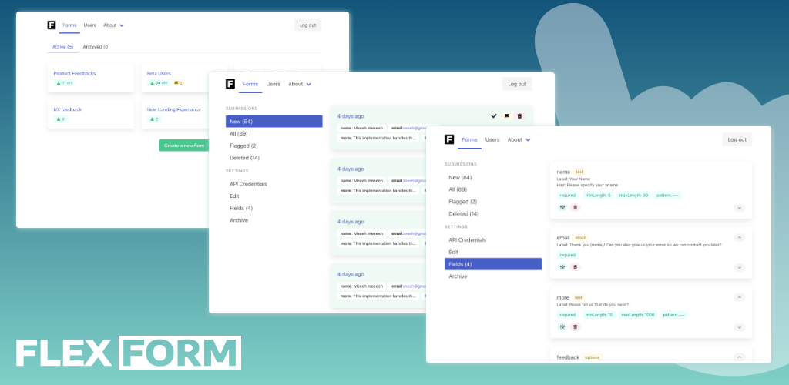

# FlexForm - Lightweight Form Server

Welcome to FlexForm, a fully open-source, headless form server designed with simplicity, efficiency, and privacy in mind. Built to be easily installed on any budget-friendly hosting solution or free cloud tiers, FlexForm is the perfect choice for developers and businesses looking for a reliable and GDPR-compliant form management solution.



# Features

- **Headless Architecture**: FlexForm is built as a headless server, offering flexibility and ease of integration with various frontend systems.
- **Robust Admin Panel**: Manage your forms with ease using our user-friendly admin panel, designed for efficient and intuitive form management.
- **Cost-Effective**: Designed to run smoothly on inexpensive hosting or free cloud services, reducing your operational costs.
- **GDPR Compliant**: We prioritize your data privacy. FlexForm ensures that all your data remains yours, complying fully with GDPR regulations.
- **Open Source**: Dive into the code, customize, and contribute! Our community-driven approach means FlexForm is continually evolving.

# Requirements
### PHP Version
- PHP 8.2 or higher.

### PHP Extensions
- GD
- ZIP
- XML

### Supported Databases
- SQLite
- MySQL
- PostgreSQL
- MariaDB
- AuroraDB

# License

FlexForm is released under MIT, ensuring it remains free and open for use and modification.

# Getting Started

 - [Deploying on cloud hosting](#deploying-on-cloud-hosting)
 - [Deploying on shared hosting](#deploying-on-shared-hosting)
 - [Running locally with docker](#running-locally-with-docker)
 - [Running locally without docker](#running-locally-with-php-server)
 - [Deploy instructions](#deploy-instructions)


## Running locally with docker
Use the latest [image from docker hub](https://hub.docker.com/r/flexform/flexform-server) to run it locally:
```bash
docker run --name flexform -d -p 9000:9000 flexform/flexform-server:0.1
```
Run DB migrations from container
```bash
docker exec -it flexform bash
php bin/console doctrine:migrations:generate
php bin/console doctrine:migrations:migrate
```

## Running locally with PHP server
Make sure you have PHP 8.2 and composer installed.
Checkout the repository jump to the folder.
Copy environment file and adjust it to your needs:
Install dependencies:
```bash
composer install
```
Run database migrations:
```bash
php bin/console doctrine:migrations:generate
php bin/console doctrine:migrations:migrate
```
Run the server:
```bash
php -S localhost:8000 -t public
```

## Deploying on shared hosting
Build the project on your local machine or [download prebuild release](https://flexform.nyc3.cdn.digitaloceanspaces.com/flexform-server-latest.zip).
Upload the files to your shared hosting.
Make sure you make "public" folder as your main folder.
Run database migrations:
```bash
php bin/console doctrine:migrations:generate
php bin/console doctrine:migrations:migrate
```

## Deploying on cloud hosting
You can deploy FlexForm on any cloud hosting provider that supports PHP 8.2 or higher.
Also you can use [FlexForm Docker Image](https://hub.docker.com/r/flexform/flexform-server) to deploy FlexForm on any cloud hosting provider that supports docker.

Make sure you:
- Set the environment variable `APP_ENV` to `prod`
- Set the environment variable `APP_SECRET` to a random string
- Set the environment variable `DATABASE_URL` to your database connection string

You can see an example of environment variables in the [.env.prod](.env.prod) file.

**Please make sure you made /app/var as persistent storage if you use SQLite. If you want to use other database please change DATABASE_URL env variable.**

Run database migrations:
```bash
php bin/console doctrine:migrations:generate
php bin/console doctrine:migrations:migrate
```

## Deploy instructions
 - [Installing FlexForm on DigitalOcean Apps](https://medium.com/@ashelestov/installing-flexform-on-digitalocean-apps-b3e5b1ba868a)

# Frontend components
FlexForm is a headless form server. This means that you can use any frontend framework to build your forms.
We provide a set of frontend components that you can use to build your forms.

Soon will be available components for React, Vue, Angular, Svelte and more.

Stay in touch with us on [Twitter](https://twitter.com/avshelestov) to get the latest updates.
